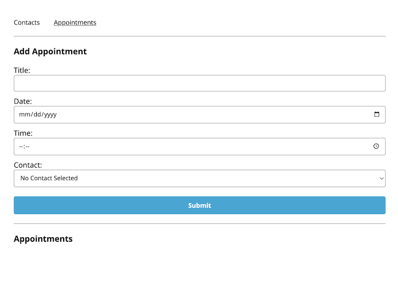

[LINK](https://65a9c7b7afd6502a7effbcad--spso-appointment-planner.netlify.app/contacts)

# Contacts / Appointments Web App

- Built with HTML / CSS / JAVASCRIPT / REACT

- This was made as part of Codecademy's Full Stack Developer course

# Features

- Add contacts to Contact List

- Create an Appointment with local date and time functionality

- Attached selected Contact to the Appointment
  (_under construction - currently contact does not populate in appointment contact picker_)

- Submit Appointment to list as a reminder of upcoming appointments
